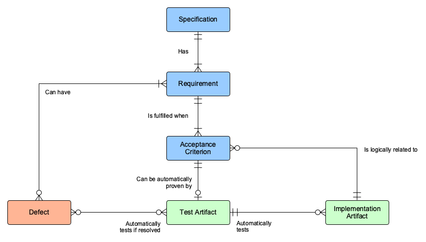
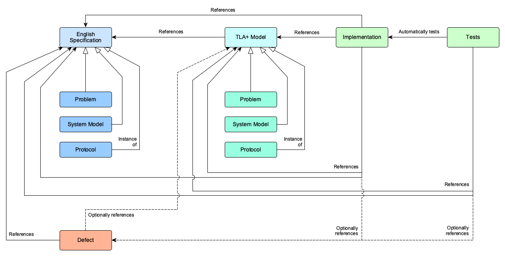
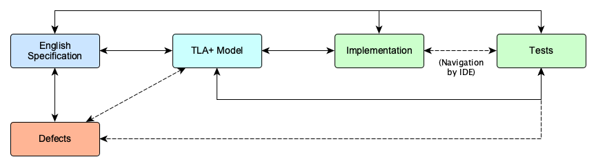

# Traceability Tooling

This proposal is intended to support and help inform the [Traceability
Proposal](./traceability.md) for Informal Systems.

## Background

### Requirements Management

[Requirements management][1] is a broad and deep area of interest in software
engineering. This breadth and depth is most clearly evident in safety-critical
software engineering efforts, such as in aerospace and military application
development, where mistakes can unnecessarily cost lives.

Notable examples of systems engineering standardization efforts that include
requirements management:

* [ISO/IEC 12207][2], which replaced [MIL-STD-498][3] for military software
  engineering.
* [DO-178C][4] for aerospace systems engineering, which embraces the use of
  formal methods for verification.

### Existing Technologies

Many technologies already exist to assist in requirements management. Some
prominent examples include:

* [IBM Engineering Requirements Management DOORS][6]
  * Video: [IBM Rational DOORS Objects][7]
  * Video: [IBM Rational DOORS Attributes][8]
  * Video: [IBM Rational DOORS Linking and Traceability][9]
  * [Product Documentation][10]
* [Eclipse Capra][17] (open source)
  * [Traceability demonstration][20]
  * [Video demonstration][18]
* [Modern Requirements][11]
* [Pearls][15]
* [Visure Requirements][16]
* [Jama Connect][13]
* [Doorstop][22] (open source)

Additional potentially useful/interesting links:

* It seems as though [GitLab is in the process of implementing some kind of
  requirements tracking functionality][23]
* [Requirements Interchange Format][19]
* See the video series [Using Qualified Tools in a DO-178C Development
  Process][5].

### Domain Analysis

When looking at the existing software packages available for requirements
management, it seems, at a high level, that the following primary concepts are
employed:

* **Specifications**, which:
  * contain requirements,
  * have attributes/metadata, and
  * have relationships to other specifications, where these relationships are
    directional and can have other arbitrary attributes associated with them.
* **Requirements**, which have:
  * globally unique identifiers,
  * relationships to other requirements, where these relationships are
    directional and can have other arbitrary attributes associated with them,
  * other arbitrary attributes, such as priority and status (e.g. "Accepted",
    "Rejected").
* **Implementation artifacts**, such as source code, which implement
  requirements.
* **Acceptance criteria**, which:
  * have globally unique identifiers,
  * relate to specific requirements, and
  * specify what is necessary to consider a requirement as being met.
* **Defects**, which
  * relate to specific requirements, and
  * are either present or absent.
* **Test artifacts**, which, when executed successfully, automatically verify
  that either
  * specific acceptance criteria are met, or
  * a specific defect has been corrected.

This is illustrated in the following diagram.

### Versioning

It seems as though most requirements management tooling implements their own
complex versioning system on top of their domain model. If, however, one had to
devise a scheme that allows people to specify the domain objects in plain text
such that it could be stored in a VCS like Git, some aspects of this versioning
would be available for free.

### Visualization

Most requirements management tools provide various ways of visualizing
requirements:

* [Traceability matrices][21]
* Traceability graphs
* Hierarchically structured documents (e.g. Microsoft Word documents with
  different levels of requirements specified at different heading levels and
  paragraph text)

### Workflow

Many of the existing tools seem as though they require that one use their user
interfaces to capture requirements and implementation status, as well as to
update requirement versions. Most seem to be able to export or import
information to/from other similar or related systems.

Collaborative capabilities, where they exist, seem embedded inside the user
interfaces of the requirements management software. It is not clear whether this
is compatible with the collaborative features available through GitHub or
GitLab.

## Desired User Experience

### Domain

**Note the following:**

* We do not formally define **acceptance criteria** at present. For practical
  purposes, we assume that our requirements are acceptance criteria as well at
  present. This may change in future.
* While we regard the TLA+ models as a form of specification, in the terminology
  of requirements management the models would technically be considered a form
  of implementation artifact (just like a simulation would be). This distinction
  does not practically affect our desired traceability.
* With regard to **defects**:
  * The term *defect* implies that there is either an existing model or existing
    implementation and test code that relate to one or more requirements, but it
    has been shown that the model and/or implementation and/or test code is
    insufficient to meet the requirement.
  * We distinguish between *defects* and *bugs*, where a defect relates to one
    or more requirements in the specifications, but a bug does not (e.g. a
    misspelled field name in a JSON-RPC response).

### Stakeholders
The requirements traceability tooling needs to support the following users:

* **Clients**, who
  * help define and refine the requirements for their project,
  * want to know how the project is progressing and
  * want to know whether their requirements have been met.
* **Researchers**, who
  * help refine project requirements,
  * write problem, system and protocol specifications (in English),
  * implement and validate models of specifications (e.g. in TLA+), and
  * implement and validate models (e.g. in TLA+) that correspond to
    implementation code.
* **Engineers**, who
  * help refine project requirements,
  * implement software according to the requirements, models and acceptance
    criteria, and
  * write tests according to the requirements and acceptance criteria.

### Use Cases

Use cases for each stakeholder for the tooling are outlined below. Derived from
the [traceability properties that need to be
satisfied](./traceability.md#3-traceability-properties).

* **All users** need to be able to
  * collaboratively define and refine requirements for their projects;
  * see which requirements are
    * modelled,
    * implemented,
    * tested, and
    * defective (and see which open GitHub/GitLab issues capture the nature of
      the defects);
  * see a high-level summary of how far the project is and how quickly it is
    progressing,
* **Researchers** additionally need to be able to
  * define which requirements must be modelled in TLA+;
  * reference specific requirements from their TLA+ models' code;
  * see when references in their TLA+ models are out of date (i.e. requirements'
    version numbers have been updated, but the references in the TLA+ models
    have not);
  * easily navigate amongst the specification, models, implementation code,
    tests and defects as per the scheme in the figure below.
* **Engineers** additionally need to be able to
  * reference specific requirements from their implementation and test code;
  * reference specific parts of TLA+ models from their implementation and test
    code;
  * see when references in the code no longer refer to existing requirements
    (i.e. if the requirement has been removed);
  * see when references in the code are out of date (i.e. requirements' version
    numbers have been updated);
  * easily navigate amongst the specification, models, implementation code,
    tests and defects as per the scheme in the figure below.

### Workflow
At present, researchers and engineers collaborate on specifications, models and
implementation through GitHub and GitLab. All artifacts are written in
structured plain text files.

It would be ideal if we could develop user experiences for all stakeholders that
keeps to the current workflow as far as possible. Important workflows to be
considered include the following.

* **Defect tracking**
  1. An issue is created on GitHub/GitLab.
  2. The issue is tagged as a `defect` to distinguish it from bugs, feature
     requests, etc.
  3. This issue must reference one or more requirements that are impacted by the
     defect.
  4. If the defect is in the implementation:
     1. a regression test must be implemented to automatically test for when the
        defect has been corrected,
     2. the necessary code changes must be made to make the regression test pass.
  5. If the defect is in the model:
     1. the model must be updated,
     2. if necessary, regression tests must be written and implementation must be
        updated accordingly.
  6. Once the defect has been corrected, the issue is closed.

### Requirement Tagging Ergonomics
It appears as though most requirements management systems use tagging systems
where little to no information about the relevant requirement is encoded in the
tag itself. Sometimes there may be some indication of where in the hierarchy of
requirements or context the specific tag exists. For example: `REQ-001`,
`TST-001`.

From our [traceability requirements](./traceability.md), it is clear that we
want tagging that has some indication of:

1. the name of the specification,
2. what the specific requirement is about,
3. where in the hierarchy of requirements a specific requirement is, and
4. the version of the requirement.

## Implementation Recommendations

### Existing Software Options

It does not seem as though any existing requirements management software is an
appropriate fit for the current team workflow.

### Text Formats for Specifications

If we make use of GitHub as our primary platform for development and
collaboration on specifications, we could either:

1. Write out specifications in [GitHub-Flavored Markdown][24].
2. Write out specifications in a different format that meets our criteria and
   then separate the means by which we write the specifications (i.e. by way of
   collaborative editing on GitHub) from how we read them (e.g. by way of a
   static site, or pre-produced PDF files).

[1]: https://en.wikipedia.org/wiki/Requirements_management
[2]: https://en.wikipedia.org/wiki/ISO/IEC_12207
[3]: https://en.wikipedia.org/wiki/MIL-STD-498
[4]: https://en.wikipedia.org/wiki/DO-178C
[5]: https://www.mathworks.com/videos/series/using-qualified-tools-in-a-do-178c-development-process.html
[6]: https://www.ibm.com/us-en/marketplace/requirements-management
[7]: https://www.youtube.com/watch?v=GAY9Xq1dcsU&list=PLFB5C518530CFEC93&index=1
[8]: https://www.youtube.com/watch?v=zfp5DEisdcs&list=PLFB5C518530CFEC93&index=2
[9]: https://www.youtube.com/watch?v=2tN_cVQP214&list=PLFB5C518530CFEC93&index=4
[10]: https://www.ibm.com/support/knowledgecenter/SSYQBZ_9.7.1/com.ibm.doors.requirements.doc/helpindex_doors.html
[11]: https://www.modernrequirements.com/
[12]: https://reqtest.com/
[13]: https://www.jamasoftware.com/platform/jama-connect/
[14]: https://www.xebrio.com/requirements-management-software
[15]: https://pearls-inc.com/products/pearls-lite-version/
[16]: https://visuresolutions.com/requirements-management-tool
[17]: https://projects.eclipse.org/projects/modeling.capra
[18]: https://www.youtube.com/watch?v=h6qntRT33gM
[19]: https://www.omg.org/spec/ReqIF/
[20]: https://www.youtube.com/watch?v=XRtLs5OT_yM
[21]: https://en.wikipedia.org/wiki/Traceability_matrix
[22]: https://doorstop.readthedocs.io/en/latest/
[23]: https://gitlab.com/groups/gitlab-org/-/epics/2703
[24]: https://github.github.com/gfm/
